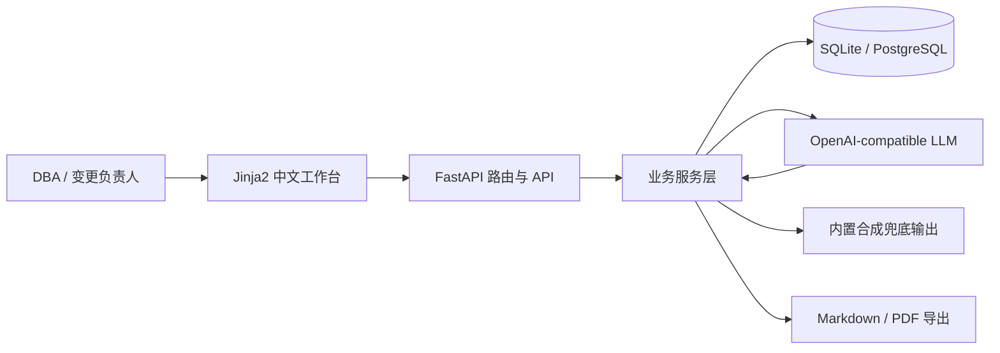
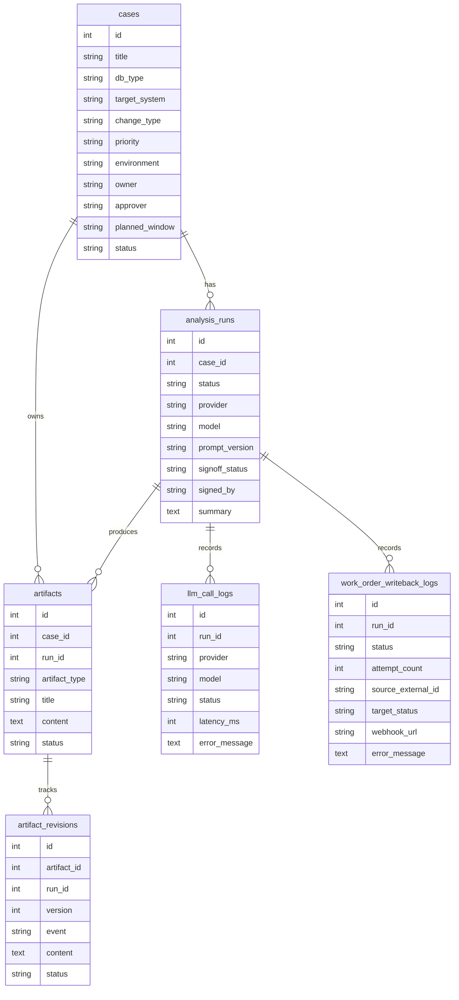
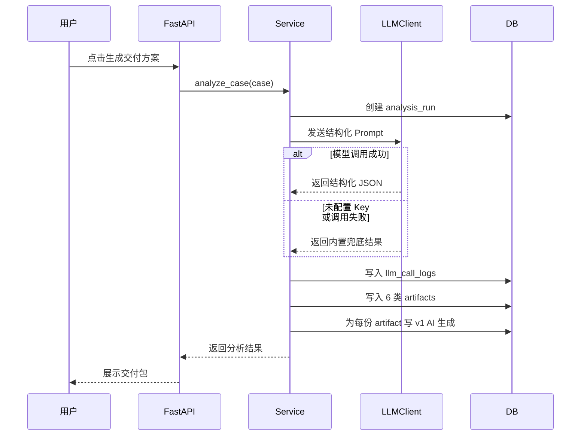

# 架构说明

## 产品边界

DBA ChangeOps AI 工作台的核心目标是把“数据库变更需求”转成“可执行、可回滚、可审计的交付包”。系统不做开放式聊天，而是围绕固定交付物组织 AI 输出和人工确认流程。

首版聚焦：

- DB2/数据库运维变更案例
- 结构化 AI 分析
- 交付物编辑和确认
- 交付包签收
- LLM 调用审计
- Markdown/PDF 导出
- 离线兜底
- 外部工单导入 API、回写 payload 生成、通用 Webhook 发送、回写日志和失败重试

暂不进入首版：

- 多租户
- 复杂权限
- 具体 ITSM 厂商字段映射和审批流闭环
- 真实 DB2 实例连接
- 企业级多级审批流

## 运行时结构



关键设计点：

- 页面以服务端渲染为主，配合本地静态 CSS 和原生增强脚本，降低前端复杂度，把时间投入到业务闭环。
- LLM 调用封装在 `app/llm.py`，业务层不绑定具体模型厂商。
- 模型失败不阻断主流程，系统会写入调用日志并使用兜底输出。
- LLM 请求和响应进入审计日志前会递归脱敏，遮蔽常见密码、Token、API Key 和连接串口令。
- 工单 Webhook 发送仍使用真实配置；写入日志/API 的 Webhook URL 和外部响应体会先脱敏，避免查询密钥、Basic Auth 密码或回显 Token 被公开展示。
- 兜底输出不是单一静态文本，会按案例类型生成 DB2 索引变更、新增字段、数据修复、REORG/RUNSTATS、锁等待应急、HADR 受控切换、表空间扩容、权限收敛、备份恢复、SQL 回放验证和分区维护的专项交付内容。
- LLM 适配层支持注入 HTTP 客户端，自动化测试覆盖无 Key、成功响应、超时失败和字段补齐。
- 所有交付物可以人工编辑，确认前后都有版本记录，并能查看最近一次内容变化。
- 一次分析运行可以在整包确认后签收，签收记录进入页面、API 和导出文档。
- 交付完成度由交付物确认状态实时计算，不新增持久化表，避免状态冗余。
- 首页交付就绪度同样由服务层从案例、分析记录、交付物和签收记录派生，作为产品第一屏状态总览。
- `/demo` 交付演示台复用现有案例与分析流程，不引入单独数据模型。
- `/demo/complete` 复用标准生成、整包确认和签收服务，只做演示路径编排，不绕过审计记录。
- `/ops` 运行状态页复用服务层统计，集中暴露数据库、模型模式、交付数据和签收核验结果。
- `/api/integrations/work-orders/import` 负责把外部工单载荷归一化为内部案例，可选择导入后直接触发分析；`/api/integrations/work-orders/runs/{run_id}/writeback-payload` 负责生成可回写到 ITSM/Jira 的状态、签收、导出链接和评论 payload；`/api/integrations/work-orders/runs/{run_id}/writeback` 在配置 `ITSM_WEBHOOK_URL` 后主动发送标准 payload；`work_order_writeback_logs` 记录每次发送和重试结果，便于排查外部系统故障。

## 数据模型



表设计解释：

- `cases`：变更输入资料、业务上下文和交付封面元数据。
- `analysis_runs`：一次 AI 分析运行，保留 provider、model、状态、摘要和交付包签收状态。
- `artifacts`：当前可编辑交付物，例如风险评估、Runbook、回滚方案。
- `artifact_revisions`：交付物版本历史，记录 AI 生成、人工编辑、人工确认。
- `llm_call_logs`：模型请求审计，包括耗时、状态、请求响应和失败原因。
- `work_order_writeback_logs`：外部工单 Webhook 发送记录，包括 attempt 次数、目标状态、请求 payload、脱敏后的响应 payload 和失败原因。
- 审计 payload 落库前会做轻量脱敏，避免公开演示或试运行时把误贴的口令、Token、API Key、Webhook 查询密钥或 Basic Auth 密码原样保存。
- `demo_fixtures`：内置合成案例，保证无外部依赖也能试跑。
- 外部工单导入当前复用 `cases`，把工单号、链接、标签和元数据写入业务背景；回写 payload 从这些来源信息和 `analysis_runs` 的交付/签收状态生成，通用 Webhook 发送层只负责认证头和 HTTP 投递。后续接入具体 ITSM 时再增加专用外部映射表、字段适配器和厂商状态机。

## AI 工作流



输出结构固定为：

- `summary`
- `artifacts.risk_assessment`
- `artifacts.runbook`
- `artifacts.rollback_plan`
- `artifacts.precheck_sql`
- `artifacts.acceptance_checklist`
- `artifacts.communication_summary`

这样做的好处：

- 页面和导出层可以稳定消费结果。
- 模型输出不完整时可以按字段兜底补齐。
- 离线兜底仍按变更类型保留 DBA 语义，例如索引案例包含 EXPLAIN、RUNSTATS 和 DROP INDEX，锁等待案例包含应急指挥、会话处置边界和监控 SQL。
- 产品讲解时可以清楚说明“可控 AI 工作流”与“聊天机器人”的区别。

导出层：

- Markdown/PDF 共享同一套案例、运行、交付物和审计数据。
- 导出文档包含文档封面、环境、负责人、审批人、计划窗口、目录、交付完成度、签收状态、交付清单、版本记录和 LLM 审计。
- 文档编号由案例 ID 和最新分析运行 ID 派生，便于解释可追溯性。

## 版本与审计

交付物状态：

- `draft`：草稿，AI 初稿或人工编辑后待确认。
- `approved`：已确认，可作为交付包输出。

版本事件：

- `generated`：AI 生成。
- `edited`：人工编辑。
- `approved`：人工确认。

版本记录解决的问题：

- 可以追踪 AI 初稿和人工修改的差异来源。
- 能展示 AI 不是直接替代 DBA，而是进入可复核流程。
- 后续可以扩展为审批流和回滚到历史版本。

版本差异：

- 差异对比基于同一交付物的相邻版本记录计算。
- 如果最新事件只是确认而没有改变正文，系统会回溯到最近一次真实内容变化。
- 页面展示增删行摘要，API 返回结构化 diff，导出文档只保留差异摘要。

交付完成度：

- 以一次 `analysis_run` 下的 6 类交付物为统计范围。
- 已确认数量来自 `artifacts.status = approved`。
- 页面、API、Markdown/PDF 导出复用同一个服务层计算函数，保证展示口径一致。
- 整包确认复用单份交付物状态和版本事件，不新增并行审批状态，避免交付口径分裂。
- 完成度用于提示待复核项，不替代 DBA 的最终判断。

交付签收：

- 签收状态存放在 `analysis_runs`，对应“一次 AI 分析生成的交付包”。
- 只有交付物全部确认后才能签收，避免未复核内容进入正式交付口径。
- 签收记录包含签收人、签收时间和签收说明，页面、API、Markdown/PDF 导出复用同一服务层摘要。
- 签收后如果再次编辑任意交付物，系统会把该运行记录重置为待签收，提示需要重新确认和复核。

首页交付就绪度：

- 统计案例数量、已有方案的案例数、交付物确认数、签收交付包数和离线兜底记录。
- 统计结果从当前数据库实时派生，不作为单独表存储。
- 目标是在产品首页快速说明“案例准备、AI 生成、人工确认、交付签收、兜底稳定性”五个维度。

交付演示台：

- 固定推荐“DB2 客户订单慢查询索引变更”作为首选案例。
- `POST /demo/start` 调用标准 `analyze_case` 流程，生成新的分析记录后跳转结果页。
- `POST /demo/complete` 调用标准 `analyze_case`、`approve_run_artifacts` 和 `signoff_run` 流程，适合现场快速展示已签收终态。
- 演示页只做路径聚合，不绕过版本、审计、交付完成度、签收和导出逻辑。

运行状态：

- `/ops` 面向部署后核验，展示数据库连接、合成案例、交付方案、交付签收和模型模式。
- `/api/system/status` 返回同一套状态数据和 `next_actions`，方便云平台、脚本或验收清单调用。
- 状态接口不暴露模型 Key 或数据库密码，只展示配置模式和脱敏数据库信息。

## 部署视角

部署时只需要一个 Python Web 服务和一个数据库：

- 本地：SQLite + Uvicorn。
- 云端：PostgreSQL + Uvicorn。

启动命令：

```bash
uvicorn app.main:app --host 0.0.0.0 --port $PORT
```

必需环境变量：

```text
DATABASE_URL=postgresql+psycopg://...
LLM_BASE_URL=https://...
LLM_API_KEY=...
LLM_MODEL=...
```

`LLM_API_KEY` 可以为空，系统仍能进入离线兜底模式。

## 工程取舍

- 选择 FastAPI：易于同时提供页面和 API，适合小型 AI 工作台。
- 选择 Jinja2 + 本地静态资源：减少前端构建复杂度，并避免现场演示依赖外部前端 CDN。
- 选择 SQLAlchemy/Alembic：让数据模型和迁移能力从第一版就清晰。
- 选择 OpenAI-compatible：不绑定单一模型厂商，便于接入国内模型。
- 选择场景化离线兜底：保证试运行稳定性，避免现场网络或额度问题，同时让无 Key 演示也能体现 DB2 运维经验。
